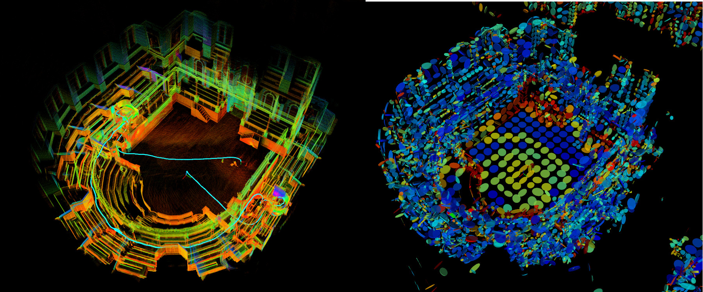
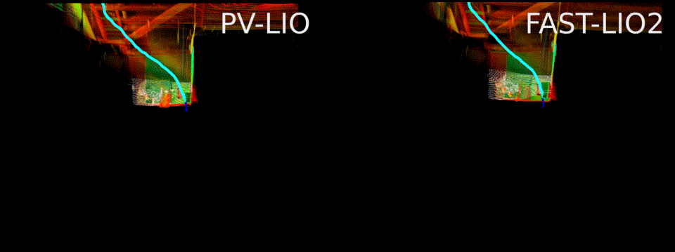
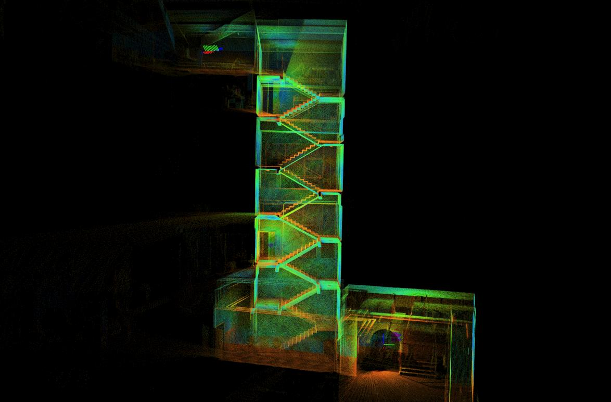

# PV-LIO
PV-LIO is a probabilistic voxelmap-based LiDAR-Inertial Odometry.  It fuses LiDAR feature points with IMU data using IKFoM to allow robust navigation in fast-motion or narrow environments where degeneration occurs. PV-LIO also supports online LiDAR-IMU extrinsic estimation.

We utilize [VoxelMap](https://github.com/hku-mars/VoxelMap) as the Local Map manager of PV-LIO, it calculates the covariance of each ```<LiDAR point,planar feature>``` correspondence according to the LiDAR ranging model and uses it as confidence ratio to guide the update of KF. This enables robust pose estimation in degenerated scenarios such as narrow staircases. We derive the covariance propagation incorporating the LiDAR-IMU extrinsic parameters, enabling state estimation with IMU and online LiDAR-IMU calibration. We also implement a parallel-optimized map update module, which allows for a more efficient map update than the original implementation of VoxelMap.

### Some test results are shown below:

#### Visualization of voxelmap with uncertainty (Hilti 2022 exp11)
<div align="left">

</div>

#### Narrow Environment Test
**Left**: Robosense RS16, staircase_crazy_rotation dataset

**Right**: Livox AVIA, long_tunnel dataset
<div align="left">
 
</div>

#### Hilti 2022 exp11

<div align="left">

</div>

#### Hilti 2022 exp15
<div align="left">

</div>

#### Hilti 2022 exp03
<div align="left">

</div>


## Update
- 2023.07.18: Fix eigen failed error for Ubuntu 20.04. 


## 1. Prerequisites

### 1.1 **Ubuntu** and **ROS**
**Ubuntu >= 16.04**

For **Ubuntu 18.04 or higher**, the **default** PCL and Eigen is enough for PV-LIO to work normally.

ROS    >= Melodic. [ROS Installation](http://wiki.ros.org/ROS/Installation)

### 1.2. **PCL && Eigen**
PCL    >= 1.8,   Follow [PCL Installation](http://www.pointclouds.org/downloads/linux.html).

Eigen  >= 3.3.4, Follow [Eigen Installation](http://eigen.tuxfamily.org/index.php?title=Main_Page).

### 1.3. **livox_ros_driver**
Follow [livox_ros_driver Installation](https://github.com/Livox-SDK/livox_ros_driver).

*Remarks:*
- The **livox_ros_driver** must be installed and **sourced** before run any PV-LIO launch file.
- How to source? The easiest way is add the line ``` source $Livox_ros_driver_dir$/devel/setup.bash ``` to the end of file ``` ~/.bashrc ```, where ``` $Livox_ros_driver_dir$ ``` is the directory of the livox ros driver workspace (should be the ``` ws_livox ``` directory if you completely followed the livox official document).


## 2. Build
Clone the repository and catkin_make:

```
    cd ~/$A_ROS_DIR$/src
    git clone https://github.com/hviktortsoi/PV_LIO.git
    cd PV_LIO
    cd ../..
    catkin_make
    source devel/setup.bash
```
- Remember to source the livox_ros_driver before build (follow 1.3 **livox_ros_driver**)
- If you want to use a custom build of PCL, add the following line to ~/.bashrc
```export PCL_ROOT={CUSTOM_PCL_PATH}```
  
## 3. Directly run
Noted:

A. Please make sure the IMU and LiDAR are **Synchronized**, that's important.

B. The warning message "Failed to find match for field 'time'." means the timestamps of each LiDAR points are missed in the rosbag file. That is important for the forward propagation and backwark propagation.
### 3.1 For Livox Avia
Connect to your PC to Livox Avia LiDAR by following  [Livox-ros-driver installation](https://github.com/Livox-SDK/livox_ros_driver), then
```
    cd ~/$PV_LIO_ROS_DIR$
    source devel/setup.bash
    roslaunch pv_lio mapping_avia.launch
    roslaunch livox_ros_driver livox_lidar_msg.launch
```
- For livox serials, PV-LIO only support the data collected by the ``` livox_lidar_msg.launch ``` since only its ``` livox_ros_driver/CustomMsg ``` data structure produces the timestamp of each LiDAR point which is very important for the motion undistortion. ``` livox_lidar.launch ``` can not produce it right now.
- If you want to change the frame rate, please modify the **publish_freq** parameter in the [livox_lidar_msg.launch](https://github.com/Livox-SDK/livox_ros_driver/blob/master/livox_ros_driver/launch/livox_lidar_msg.launch) of [Livox-ros-driver](https://github.com/Livox-SDK/livox_ros_driver) before make the livox_ros_driver pakage.

### 3.2 For Livox serials with external IMU

mapping_avia.launch theratically supports, mid-70, mid-40 or other livox serial LiDAR, but need to setup some parameters befor run:

Edit ``` config/avia.yaml ``` to set the below parameters:

1. LiDAR point cloud topic name: ``` lid_topic ```
2. IMU topic name: ``` imu_topic ```
3. Translational extrinsic: ``` extrinsic_T ```
4. Rotational extrinsic: ``` extrinsic_R ``` (only support rotation matrix)
- The extrinsic parameters in PV-LIO is defined as the LiDAR's pose (position and rotation matrix) in IMU body frame (i.e. the IMU is the base frame). They can be found in the official manual.
- PV-LIO produces a very simple software time sync for livox LiDAR, set parameter ```time_sync_en``` to ture to turn on. But turn on **ONLY IF external time synchronization is really not possible**, since the software time sync cannot make sure accuracy.

### 3.3 For Velodyne or Ouster (Velodyne as an example)

Step A: Setup before run

Edit ``` config/velodyne.yaml ``` to set the below parameters:

1. LiDAR point cloud topic name: ``` lid_topic ```
2. IMU topic name: ``` imu_topic ``` (both internal and external, 6-aixes or 9-axies are fine)
3. Line number (we tested 16, 32 and 64 line, but not tested 128 or above): ``` scan_line ```
4. Translational extrinsic: ``` extrinsic_T ```
5. Rotational extrinsic: ``` extrinsic_R ``` (only support rotation matrix)
- The extrinsic parameters in PV-LIO is defined as the LiDAR's pose (position and rotation matrix) in IMU body frame (i.e. the IMU is the base frame).

Step B: Run below
```
    cd ~/$PV_LIO_ROS_DIR$
    source devel/setup.bash
    roslaunch pv_lio mapping_velodyne.launch
```

Step C: Run LiDAR's ros driver or play rosbag.


### 3.4 For Robosense, Hesai, etc. (Robosense as an example)

Step A: Setup before run

Edit ``` launch/mapping_robosense.launch ```,  find and modify the following line:
```
<remap from="/rslidar_points" to="/your_lidar_topic"/>
```
Fill `/your_lidar_topic` with your actual LiDAR topic name.

Step B:
Edit ``` config/robosense.yaml ``` to set the below parameters:
1. IMU topic name: ``` imu_topic ``` (both internal and external, 6-aixes or 9-axies are fine)
3. Line number (we tested 16, 32 and 64 line, but not tested 128 or above): ``` scan_line ```
4. Translational extrinsic: ``` extrinsic_T ```
5. Rotational extrinsic: ``` extrinsic_R ``` (only support rotation matrix)
- The extrinsic parameters in PV-LIO is defined as the LiDAR's pose (position and rotation matrix) in IMU body frame (i.e. the IMU is the base frame).

Step C: Run below
```
    cd ~/$PV_LIO_ROS_DIR$
    source devel/setup.bash
    roslaunch pv_lio mapping_robosense.launch
```

Step C: Run LiDAR's ros driver or play rosbag.

[comment]: <> (### 3.4 PCD file save)

[comment]: <> (Set ``` pcd_save_enable ``` in launchfile to ``` 1 ```. All the scans &#40;in global frame&#41; will be accumulated and saved to the file ``` PV_LIO/PCD/scans.pcd ``` after the PV-LIO is terminated. ```pcl_viewer scans.pcd``` can visualize the point clouds.)

[comment]: <> (*Tips for pcl_viewer:*)

[comment]: <> (- change what to visualize/color by pressing keyboard 1,2,3,4,5 when pcl_viewer is running. )

[comment]: <> (```)

[comment]: <> (    1 is all random)

[comment]: <> (    2 is X values)

[comment]: <> (    3 is Y values)

[comment]: <> (    4 is Z values)

[comment]: <> (    5 is intensity)

[comment]: <> (```)

## 4. Rosbag Example
### 4.1 Robosense 16 Rosbag 

<div align="left">

</div>

Files: Can be downloaded from [Baidu Pan (password:4kpf)](https://pan.baidu.com/s/1VHIVYo2LAyFKzMzdilOZlQ) or [Google Drive](https://drive.google.com/drive/folders/1f-VQOORs1TA5pT-OO_7-rG0kW5F5UoGG?usp=sharing)

Run:
```
roslaunch pv_lio mapping_robosense.launch
cd YOUR_BAG_DOWNLOADED_PATH
rosbag play *.bag
```
**Important:** The 3 bags are from the same dataset sequence, so they should be play sequentially, rather than be played alone.

## Related Works
1. [VoxelMap](https://github.com/hku-mars/VoxelMap): An efficient and probabilistic adaptive voxel mapping method for LiDAR odometry.
2. [FAST-LIO](https://github.com/hku-mars/FAST_LIO): A computationally efficient and robust LiDAR-inertial odometry (LIO) package
2. [FAST-LIO_LOCALIZATION](https://github.com/HViktorTsoi/FAST_LIO_LOCALIZATION): A simple localization framework that can re-localize in built point cloud maps.
3. [IKFoM](https://github.com/hku-mars/IKFoM): A computationally efficient and convenient toolkit of iterated Kalman filter.


## Acknowledgments
Thanks a lot for the authors of [VoxelMap](https://github.com/hku-mars/VoxelMap), [IKFoM](https://github.com/hku-mars/IKFoM) and [FAST-LIO](https://github.com/hku-mars/FAST_LIO);

Thanks to Xiaokai for his help with deriving the covariance propagation.

## TBD
1. Handle conditions where nMeasurements < nDof;
2. Migrate constant velocity example from VoxelMap to support Pure LiDAR odometry;
3. Optimize comments and docs, make them more readable;
4. Improve the efficiency of voxel map visualization;
5. Publish covariance of points for visualization;
